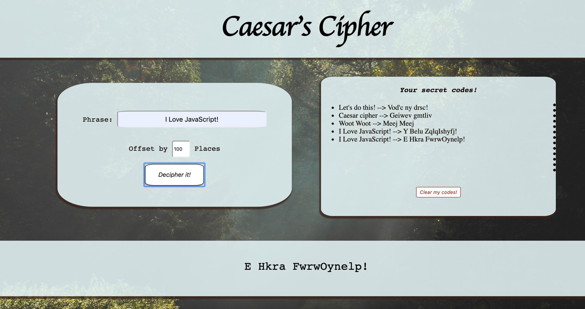

# Caesar's Cipher

A full stack solution to Caesar's Cipher.  Will take an input phrase and a
specified offset ammount, and output the correctly encoded solution.

# Dependencies
* [Angular.js](https://angular.io/guide/setup-local)
* [Node.js](https://nodejs.org/es/docs/)
* [Nest.js](https://docs.nestjs.com/)

## User Stories
As a user I would like to be able to...
* enter a phrase (string) and a offset ammount (number) into a form
* submit that form to a successful call
* receive a correctly encoded string in return
* receive error messages/visual feedback for invalid inputs/bad requests
* see my previous queries until the page reloads
* be able to access my previous search queries

## Back-end Specifications
* contain the logic for the Caesar's Cipher
* implement uniting testing (api/src/app.controller.spec.ts)

## Aditional Resources
In addition to documentation about, additional resources used for additional learning/guidance:
* [Codevolution Angular Forms Tutorial](https://www.youtube.com/watch?v=nGr3C3wbh9c&list=PLC3y8-rFHvwhwL-XH04cHOpJnkgRKykFi)
* [Academind Learn Nest.js from Scratch](https://www.youtube.com/watch?v=F_oOtaxb0L8)
